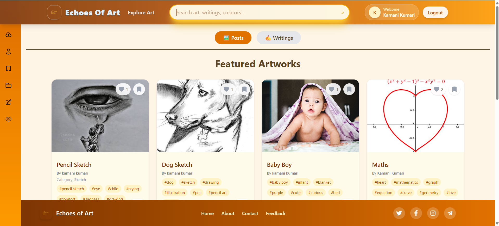
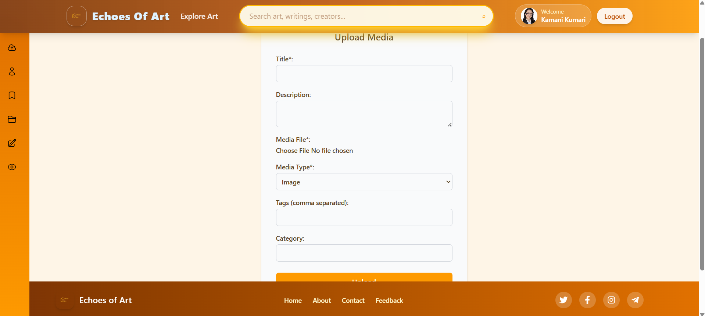
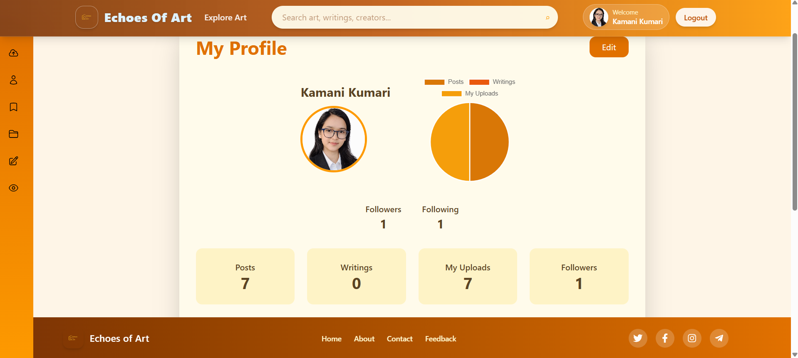
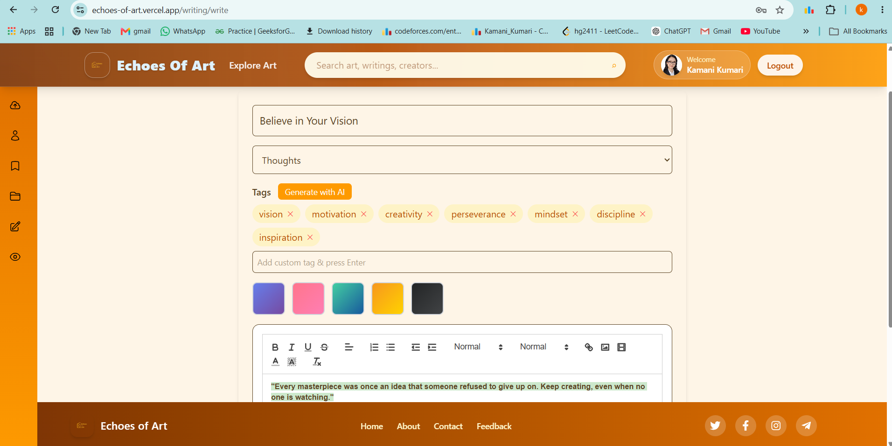
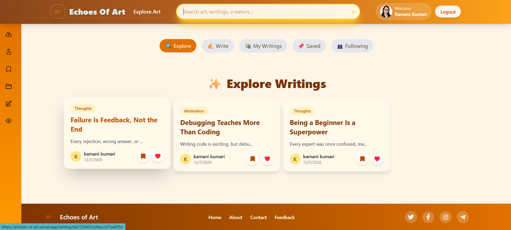
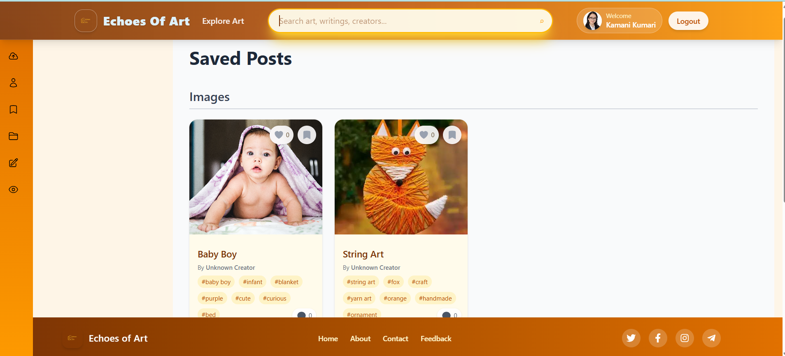

<h1 align="center"> EchoesOfArt</h1>

<p align="center">
A Full Stack Art Sharing & Creative Writing Platform
</p>
<div align="center">

EchoesOfArt is a creative social platform for artists, writers, and readers to share work, discover new creators, follow favorite profiles, save posts, and collaborate through comments, replies, and likes.

</div>

---

<div align="center">


</div>

---

## Table of Contents

- [Features](#features)
- [Tech Stack](#tech-stack)
- [Folder Structure](#folder-structure)
- [Getting Started](#getting-started)
- [Environment Variables](#environment-variables)
- [Screenshots](#screenshots)


---

## Features

- **Authentication** - Register, log in, verify email with OTP, and manage your profile securely.
- **Creator Profiles** - Follow and unfollow creators, view their profile, and explore their published work.
- **Writing Platform** - Create, edit, publish, save,  like, report, and delete writings.
- **Community Interaction** - Comment on posts, reply to comments, react to discussions, and keep conversations active.
- **Content Discovery** - Explore posts, browse similar content, and view personalized feeds.
- **Saved and Liked Content** - Keep track of posts and writings you want to revisit later.
- **Media Uploads** - Upload post attachments and profile images with backend file handling and cloud storage support.
- **AI Assistance** - Generate tags for writings with AI-assisted tagging.
- **Analytics** - Track post likes over time with chart-based visualizations.
- **Responsive UI** - Built for a clean reading and browsing experience on desktop and mobile.

---

## Tech Stack

### Frontend

| Technology | Purpose |
|---|---|
| **React | UI framework |
| **Tailwind CSS** | Utility-first styling |
| **React Router DOM** | Client-side routing |
| **Socket.io ** | Real-time updates |
| **Axios** | API communication |
| **Quill / React-Quill** | Rich text writing editor |
| **Chart.js / react-chartjs-2** | Analytics charts |


### Backend

| Technology | Purpose |
|---|---|
| **Node.js** | Runtime environment |
| **Express.js** | REST API framework |
| **MongoDB + Mongoose** | Database  |
| **Socket.io** | Real-time communication |
| **JWT** | Authentication tokens |
| **bcryptjs** | Password hashing |
| **Multer** | File upload middleware |
| **Cloudinary** | Cloud file storage |
| **Nodemailer** | Email and OTP delivery |

---

## Folder Structure

```text
EchoesOfArt/
├── Backend/
│   ├── app.js
│   ├── server.js
│   ├── config/
│   │   ├── cloudinary.js
│   │   └── db.js
│   ├── controllers/
│   │   ├── authController.js
│   │   ├── commentController.js
│   │   ├── postController.js
│   │   ├── userController.js
│   │   └── writingController.js
│   ├── middleware/
│   │   ├── authMiddleware.js
│   │   └── loggerMiddleware.js
│   ├── models/
│   │   ├── Comment.js
│   │   ├── Liked.js
│   │   ├── Post.js
│   │   ├── Saved.js
│   │   ├── User.js
│   │   └── Writing.js
│   ├── routes/
│   │   ├── authRoutes.js
│   │   ├── commentRoutes.js
│   │   ├── liked.js
│   │   ├── postRoutes.js
│   │   ├── savedRoutes.js
│   │   └── writingRoutes.js
│   ├── socket/
│   │   └── commentSocket.js
│   └── uploads/
├── frontend
│   ├── public
│   ├── src
│   │   ├── assets
│   │   ├── components
│   │   │   ├── ArtCard.jsx
│   │   │   ├── CommentDrawer.jsx
│   │   │   ├── CommentSection.jsx
│   │   │   ├── ExploreFilters.jsx
│   │   │   ├── FollowButton.jsx
│   │   │   ├── Footer.jsx
│   │   │   ├── Header.jsx
│   │   │   ├── Layout.jsx
│   │   │   ├── LazyVideo.jsx
│   │   │   ├── MyWritings.jsx
│   │   │   ├── Sidebar.jsx
│   │   │   ├── WritingCard.jsx
│   │   │   ├── WritingComments.jsx
│   │   │   ├── WritingEditor.jsx
│   │   │   └── WritingPost.jsx
│   │   │
│   │   ├── config
│   │   │   └── api.js
│   │   │
│   │   ├── context
│   │   │   └── AuthProvider.jsx
│   │   │
│   │   ├── hooks
│   │   │   ├── useDebounce.js
│   │   │   └── useFollow.js
│   │   │
│   │   ├── pages
│   │   │   ├── LandingPage.jsx
│   │   │   ├── Home.jsx
│   │   │   ├── Upload.jsx
│   │   │   ├── Login.jsx
│   │   │   ├── Register.jsx
│   │   │   ├── Profile.jsx
│   │   │   ├── CreatorProfile.jsx
│   │   │   ├── PostDetails.jsx
│   │   │   ├── Saved.jsx
│   │   │   ├── SavedWritings.jsx
│   │   │   ├── MyUploads.jsx
│   │   │   ├── WritingPage.jsx
│   │   │   ├── SingleWriting.jsx
│   │   │   ├── ExploreWriting.jsx
│   │   │   ├── CreatorPublishedWritings.jsx
│   │   │   ├── FollowedAuthors.jsx
│   │   │   ├── verifyEmail.jsx
│   │   │   ├── AboutUs.jsx
│   │   │   ├── ContactUs.jsx
│   │   │   └── Feedback.jsx
│   │   │
│   │   ├── styles
│   │   ├── utils
│   │   ├── socket.js
│   │   ├── App.jsx
│   │   └── main.jsx
│   │
│   ├── package.json
│   └── vite.config.js
│
└── README.md
```

---

## Getting Started

### Prerequisites

- [Node.js](https://nodejs.org/) v18 or later
- [MongoDB](https://www.mongodb.com/) local instance or Atlas connection
- [Cloudinary](https://cloudinary.com/) account for media uploads
- SMTP or email service credentials for OTP delivery

### Installation

1. Clone the repository.

	```bash
	git clone https://github.com/ultimatrix2/CampusConnect.git
	cd EchoesOfArt
	```

2. Install backend dependencies.

	```bash
	cd Backend
	npm install
	```

3. Install frontend dependencies.

	```bash
	cd ../frontend
	npm install
	```

4. Add the environment variables listed below to a `.env` file inside `Backend/`.

5. Start the backend server.

	```bash
	cd Backend
	npm run dev
	```

6. Start the frontend app in a second terminal.

	```bash
	cd frontend
	npm run dev
	```

---

## Environment Variables

Create a `.env` file in `Backend/` with values like these:

| Variable | Description |
|---|---|
| `PORT` | Backend port, usually `5001` |
| `MONGO_URL` | MongoDB connection string |
| `JWT_SECRET` | Secret used to sign JWT tokens |
| `CLOUDINARY_CLOUD_NAME` | Cloudinary cloud name |
| `CLOUDINARY_API_KEY` | Cloudinary API key |
| `CLOUDINARY_API_SECRET` | Cloudinary API secret |
| `EMAIL_USER` | Email account used for OTP delivery |
| `EMAIL_PASS` | Email account password or app password |

---

## Screenshots

| Home | Upload Artwork |
|------|----------------|
|  |  |

| Creator Profile | Explore Gallery |
|-----------------|-----------------|
|  |  |

| Writing Editor | Comments |
|----------------|----------|
|  |  |

| Saved Posts |
|-------------|
|  |


